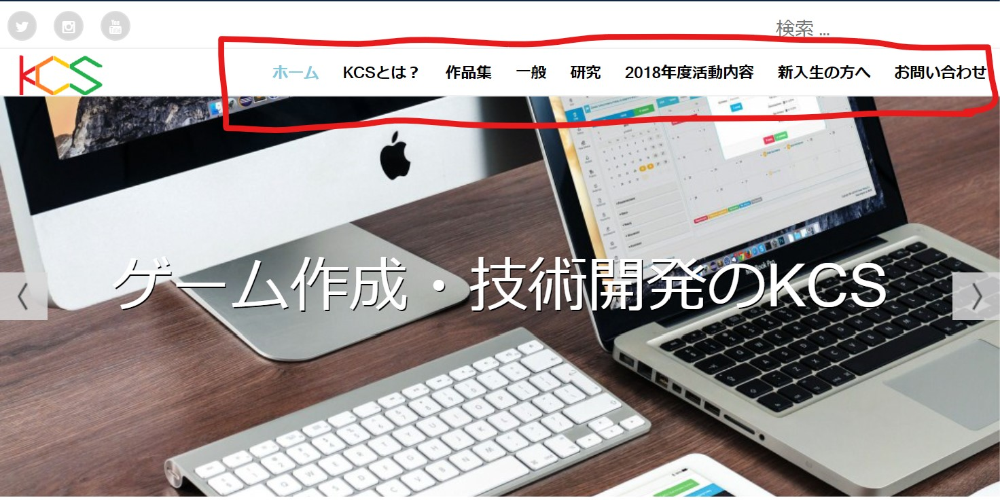

# 概要

教科書P77~134

* リスト
* ナビゲーション
* 表
* フォーム

## リスト

リストをHTMLで表示する場合は、リストとなる部分をul/olタグで囲み、中の項目をそれぞれliタグで囲む

* ulタグ: Unordered List ... 順序なしリスト
* olタグ: Ordered List ... 順序ありリスト
* liタグ: List ... リストの項目

### ulタグ(順序なしリスト)

順番を入れ替えても問題のないものを並べる。属性はない。デザインはCSSで変えよう

```HTML
<ul>
	<li>理工学部</li>
	<li>経済学部</li>
	<li>文学部</li>
</ul>
```

> 結果:
> 
> <ul>
>	<li>理工学部</li>
>	<li>経済学部</li>
>	<li>文学部</li>
> </ul>

入れ子にもできる

```HTML
<ul>
	<li>理工学部
		<ul>
			<li>情報工学科</li>
			<li>電気情報工学科</li>
			<li>数理科学科</li>
		</ul>
	</li>
	<li>経済学部</li>
	<li>文学部</li>
</ul>
```

> 結果:
> 
> <ul>
>	<li>理工学部
> 		<ul>
>			<li>情報工学科</li>
>			<li>電気情報工学科</li>
>			<li>数理科学科</li>
>		</ul>
> </li>
>	<li>経済学部</li>
>	<li>文学部</li>
> </ul>

> 入れ子は無限にできる

### olタグ(順序ありリスト)

ランキングなど順番のある情報を表す。

```HTML
<ol>
	<li>Samsung</li>
	<li>Huawei</li>
	<li>Apple</li>
</ol>
```

> 結果: 
> <ol>
>	<li>Samsung</li>
>	<li>Huawei</li>
>	<li>Apple</li>
> </ol>

属性に`reversed`, `start`, `type`が使える

* reversed: trueでリストの"数字"を逆順にする
* start: 最初の数字を指定する
* type: 数える文字の種類を指定する
  * `a`, `A`, `i`, `I`, `1`が使えるのかな

```HTML
<ol reversed="true" start="5" type="i">
	<li>Samsung</li>
	<li>Huawei</li>
	<li>Apple</li>
</ol>
```
> 結果:
> <ol reversed="true" start="5" type="i">
>	<li>Samsung</li>
>	<li>Huawei</li>
>	<li>Apple</li>
> </ol>

## 定義リスト(説明リスト)

Q&Aや日付と記事タイトルのように、対になった情報のためのリスト

* dlタグ: Definition List ... 定義リスト
* dtタグ: Definition Term ... 定義リスト内で用語に使う
* ddタグ: Definition Description ... 定義リスト内で説明に使う

```HTML
<dl>
	<dt>2019-07-28</dt>
	<dd>お盆期間の営業について</dd>
	<dt>2019-06-16</dt>
	<dd>意見交換会を開催しました</dd>
	<dt>2019-05-18</dt>
	<dd>社内研修のため休業いたします</dd>
	<dd>プレスリリース発表しました</dd>
</dl>
```

>結果:
><dl>
>	<dt>2019-07-28</dt>
>	<dd>お盆期間の営業について</dd>
>	<dt>2019-06-16</dt>
>	<dd>意見交換会を開催しました</dd>
>	<dt>2019-05-18</dt>
>	<dd>社内研修のため休業いたします</dd>
>	<dd>プレスリリース発表しました</dd>
></dl>

dtとddのセットはそれぞれ1つ以上あればよい(dt一つに対してdd複数・dt複数に対してdd一つ・dt複数に対してdd複数 全て許される)

## ナビゲーション

この部分



* navタグ: ナビゲーションを表す

```HTML
<nav>
	<ul>
	<li>理工学部
		<ul>
			<li>情報工学科</li>
			<li>電気情報工学科</li>
			<li>数理科学科</li>
		</ul>
	</li>
	<li>経済学部</li>
	<li>文学部</li>
</ul>
</nav>
```

リストをnavで囲うだけです

リンクもつけるといいかも

> パンくずリスト？知らんな(olタグでやればいいんじゃないかな)

## 表を作る

表はtableタグで囲う。trタグで1行ずつ作っていく。

* tableタグ: 表を作る
* 中身の要素
  * trタグ: Table Row ... 行を作る
  * tdタグ: Table Data ... セルを表す
  * thタグ: Table Header ... 見出しセル
* 行の意味づけ(見た目に影響しない)
  * theadタグ: ヘッダー部分の行グループ
  * tbodyタグ: メインの行グループ
  * tfootタグ: フッター部分の行グループ
* その他
  * captionタグ: 表の見出しや説明

### 基本

```HTML
<table>
	<tr>
		<th>Google</th>
		<td>Android</td>
		<td>Pixel</td>
	</tr>
	<tr>
		<th>Apple</th>
		<td>iOS</td>
		<td>iPhone</td>
	</tr>
</table>
```

>結果:
><table>
>	<tr>
>		<th>Google</th>
>		<td>Android</td>
>		<td>Pixel</td>
>	</tr>
>	<tr>
>		<th>Apple</th>
>		<td>iOS</td>
>		<td>iPhone</td>
>	</tr>
></table>

table > tr > th,tdの順に入れ子にする。

### セルの結合

結合というよりは拡大？ colspan属性で何列に渡るか、row属性で何行に渡るかを指定する。

```HTML
<table border="1">
	<tr>
		<td colspan="2">A</td>
		<td>B</td>
	</tr>
	<tr>
		<td>C</td>
		<td colspan="2" rowspan="2">D</td>
	</tr>
	<tr>
		<td>E</td>
	</tr>
	<tr>
		<td>Z</td>
		<td>Z</td>
		<td>Z</td>
	</tr>
</table>
```

>結果:
><table border="1">
>	<tr>
>		<td colspan="2">A</td>
>		<td>B</td>
>	</tr>
>	<tr>
>		<td>C</td>
>		<td colspan="2" rowspan="2">D</td>
>	</tr>
>	<tr>
>		<td>E</td>
>	</tr>
>	<tr>
>		<td>Z</td>
>		<td>Z</td>
>		<td>Z</td>
>	</tr>
></table>

> なんか...面倒だね

### その他

* th#scope属性: rowとcolumnどちらにデータが続いているかを指定

```HTML
<table>
	<caption>料金プラン</caption>
	<thead>
		<tr>
			<th scope="col">項目</th>
			<th scope="col">ライトプラン</th>
			<th scope="col">スタンダードプラン</th>
		</tr>
	</thead>
	<tbody>
		<tr>
			<th scope="row">入会費</th>
			<td>15000円</td>
			<td>0円</td>
		</tr>
		<tr>
			<th scope="row">月会費</th>
			<td>1980円</td>
			<td>2980円</td>
		</tr>
	</tbody>
	<tfoot>
		<tr>
			<th scope="row">初年度合計</th>
			<td>38760円</td>
			<td>35760円</td>
		</tr>
	</tfoot>
</table>
```

>結果:
><table>
>	<caption>料金プラン</caption>
>	<thead>
>		<tr>
>			<th scope="col">項目</th>
>			<th scope="col">ライトプラン</th>
>			<th scope="col">スタンダードプラン</th>
>		</tr>
>	</thead>
>	<tbody>
>		<tr>
>			<th scope="row">入会費</th>
>			<td>15000円</td>
>			<td>0円</td>
>		</tr>
>		<tr>
>			<th scope="row">月会費</th>
>			<td>1980円</td>
>			<td>2980円</td>
>		</tr>
>	</tbody>
>	<tfoot>
>		<tr>
>			<th scope="row">初年度合計</th>
>			<td>38760円</td>
>			<td>35760円</td>
>		</tr>
>	</tfoot>
></table>

## フォーム

HTMLはformという機能を使ってWebサーバにリクエストを送ることができる。inputタグを使ってユーザにパラメータを入力させることもできる。

ex) Googleの検索窓


フォームはひとまとまりをformタグで囲う。

* formタグ: フォームを作る
  * action属性: リクエストの送信先
  * method属性: リクエストの種類

```HTML
<form action="/search" method="GET">
	<!--内容-->
</form>
```

### method属性について

* GET: パラメータをURLにつけて送る
* POST: パラメータをBodyに格納して送る

### inputタグ

* inputタグ: フォームの入力を定義する
  * type属性: 入力形式を決める
  * name属性: パラメータの名前を決める
  * value属性: パラメータの初期値
  * required属性: 必須項目にする

```HTML
<form>
	<input type="text" name="text"/><br/>
	<input type="password" name="pass"/><br/>
	<input type="checkbox" name="checked"/><br/>
	<input type="radio" name="radio"/><br/>
	<input type="file" name="file"/><br/>
	<input type="hidden" name="hiddenValue" value ="hogehoge"/><br/>
	<input type="submit"/><br/>
	<input type="reset"/><br/>
	<input type="button" value="ボタン"/><br/>
	<input type="image" src="img/icon.png"/><br/>
	<input type="search" name="q"/><br/>
	<input type="tel" name="number"/><br/>
	<input type="url" name="url"/><br/>
	<input type="email" name="mail"/><br/>
	<input type="date" name="date"/>
</form>
```

>結果:
><form>
>	<input type="text" name="text"/><br/>
>	<input type="password" name="pass"/><br/>
>	<input type="checkbox" name="checked"/><br/>
>	<input type="radio" name="radio"/><br/>
>	<input type="file" name="file"/><br/>
>	<input type="hidden" name="hiddenValue" value ="hogehoge"/><br/>
>	<input type="submit"/><br/>
>	<input type="reset"/><br/>
>	<input type="button" value="ボタン"/><br/>
>	<input type="image" src="img/icon.png"/><br/>
>	<input type="search" name="q"/><br/>
>	<input type="tel" name="number"/><br/>
>	<input type="url" name="url"/><br/>
>	<input type="email" name="mail"/><br/>
>	<input type="date" name="date"/>
></form>

### ドロップダウン

クリックすると複数選択肢の現れるやつ

* selectタグ: ドロップダウンメニューを作る
  * name属性: 名前を指定
  * size属性: メニューの数を指定
  * required属性: 必須項目にする
* optionタグ: ドロップダウンメニューの項目を作る
  * value属性: 選択されたものの値
  * selected属性: 元から選択済みにする

```HTML
<form>
	<select name="gender" required="true">
		<option value="male">男性</option>
		<option value="female" selected>女性</option>
		<option value="other">その他</option>
	</select>
</form>
```

>結果:
><form>
>	<select name="gender" required="true">
>		<option value="male">男性</option>
>		<option value="female" selected>女性</option>
>		<option value="other">その他</option>
>	</select>
></form>

> optgroupタグで分類もできる

### 複数行の入力欄

* textareaタグ: 複数行の文字入力欄を作る
  * cols属性: 1行あたりの最大文字数
  * rows属性: 入力欄の高さ(行数)
  * placeholder属性: ヒントを表示

```HTML
<form>
	<textarea name="note" placeholder="備考欄"></textarea>
</form>
```

>結果:
><form>
>	<textarea name="note" placeholder="備考欄"></textarea>
></form>

### ボタン

* buttonタグ: ボタンを作る
  * type属性: ボタンの動作を決める

```HTML
<form>
	<button type="submit">確定</button>
	<button type="button" onclick="alert('アラート');">じゃゔぁ</button>
</form>
```

>結果:
><form>
>	<button type="submit">確定</button>
>	<button type="button" onclick="alert('アラート');">じゃゔぁ</button>
></form>

### label要素で使いやすくできるよ

## 演習問題

携帯の申し込みページでも作る？
