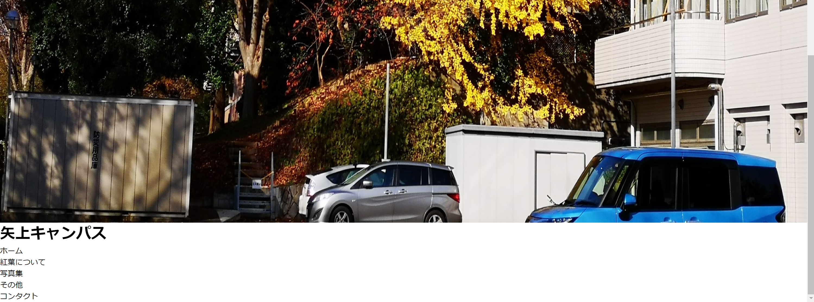
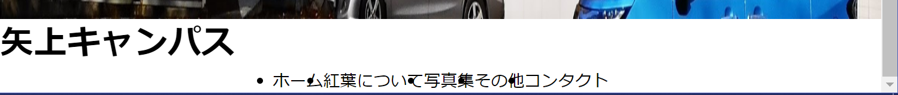
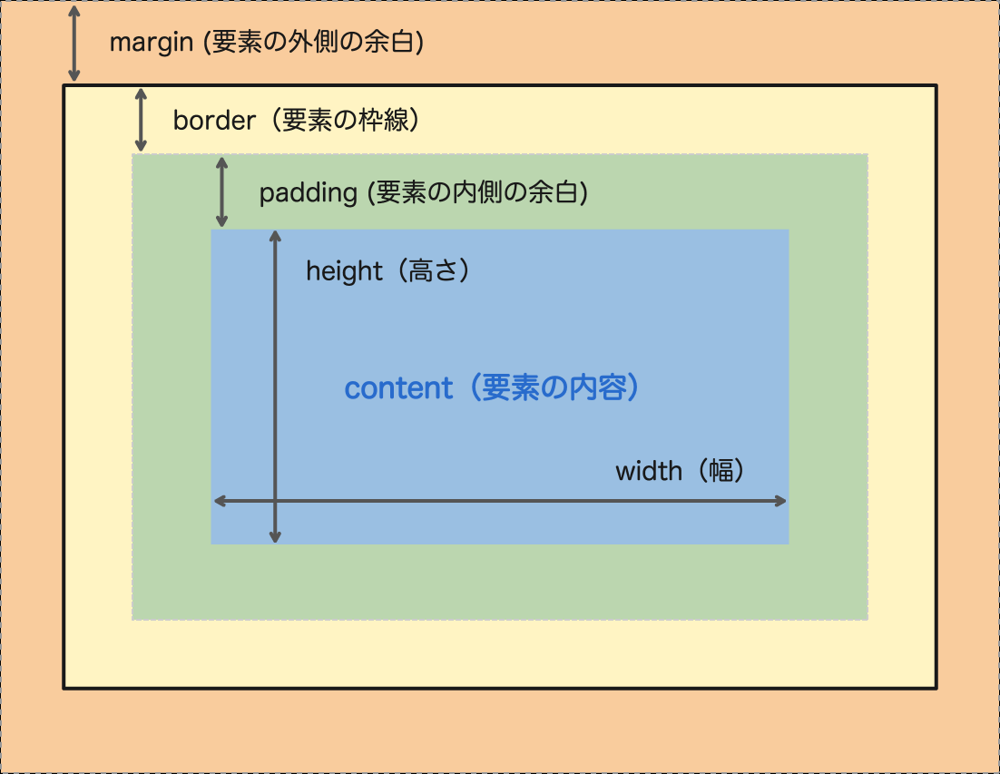
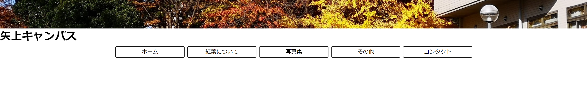
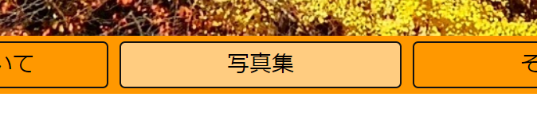

# 概要

教科書P184~246の一部

* CSSレイアウト
* ヘッダを作る

## レイアウトしてみよう


こんな感じのヘッダー部分を作る

## HTMLの用意


要素はこんな感じなので、全てが入ったHTMLを書く

index.html

```HTML
<!DOCTYPE html>
<html>
<body>
	<header>
		
		<h1>矢上キャンパス</h1>
		<nav>
			<ul>
				<li>ホーム</li>
				<li>紅葉について</li>
				<li>写真集</li>
				<li>その他</li>
				<li>コンタクト</li>
			</ul>
		</nav>
	</header>
</body>
</html>
```

## CSSファイルの用意

index.htmlと同じフォルダにstyle.cssファイルを作る

邪魔なので余白を消す

```CSS
* {
	margin: 0;
	padding: 0;
}
```

index.htmlのheadにlinkを記述

```HTML
<html>
	<head>
		<link href="style.css" rel="stylesheet" type="text/css">
	</head>
	<body>
	<!--省略-->
```

## 縦横に並べる(Flexbox)

親要素にdisplay: flex;を適用すると子要素は縦横並びになる

* display: flex; ... 子要素を並ばせる
* flex-direction
  * row(初期値) ... 左から右
  * row-reverse ... 右から左
  * column ... 上から下
  * column-reverse ... 下から上

divタグにheader_layoutクラスをつけて要素を囲む

```HTML
	<header>
		<div class="header_layout">
			
			<h1>矢上キャンパス</h1>
			<nav>
				<ul>
					<li>ホーム</li>
					<li>紅葉について</li>
					<li>写真集</li>
					<li>その他</li>
					<li>コンタクト</li>
				</ul>
			</nav>
		</div>
	</header>
```

cssでheader_layoutを定義

```CSS
.header_layout {
	display: flex;
	flex-direction: column;
}
```

とりあえず縦に並んだ



### ナビゲーションも整える(justify-content)

* justify-content
  * flex-start(初期値) ... 左寄せ
  * flex-end ... 右寄せ
  * center ... 中央寄せ
  * space-between ... 左右に広がる
  * space-around ... 均等に広がる

cssでリストの並びを横に変更

```CSS
nav ul {
	display: flex;
	flex-direction: row;
	justify-content: center;
}
```

中央横に並ぶ



## 画像の大きさを制御する

widthとheightで大きさを定義する

幅いっぱいの32:9で表示したい

→幅:100% 高さ:幅の28.1%

vwは画面幅を100vwとしたときの相対値

9/32 = 28.1%

* object-fit (IE非対応)
  * fill ... 縦横にぴったりなるように変形(歪む)
  * contain ... 比率を維持しながら全体が映るように縮小
  * cover ... 歪ませず指定大きさにトリミング・リサイズ
  * none ... 何もせず一部のみ表示
  * scale-down ... containとnoneの小さい方

```CSS
.header_layout img {
	width: 100%;
	height: 28.1vw;
	object-fit: cover;
}
```

それっぽい比率になった


## ナビゲーションの大きさとかも変える

liタグに色々つけてみる

```CSS
nav ul li {
	padding: 4px;
	border: 1px solid #121212;
	border-radius: 4px;
	margin: 4px;
	list-style-type: none;
	width: 192px;
	text-align: center;
}
```

ボックスモデル



(https://nulab.com/ja/blog/nulab/css-basics-for-engineer-boxmodel/ より引用)

* list-style-type: none; ... リストの最初の点をなしにする
* text-align: center; ... テキストを中央寄せにする
* border-radius ... 枠線の角の半径を指定

まあいいんじゃないかね



ついでにナビゲーション全体に背景を付けておく

```CSS
nav {
	width: 100%;
	background-color: #FF9800;
}
```

## 見出しを画像の中心に置く(position)

要素を並びでなく画面の絶対的な位置やある要素からの相対位置に置きたいときは

position: relativeかabsoluteを使う

* position
  * relative ... 要素が本来ある位置からの相対的な位置を指定する
  * absolute ... 画面もしくは親要素からの絶対的な位置を指定する

absoluteを親要素依存にしたい場合は親要素にrelativeを適用する

親要素を指定したいので画像と文字をdivで囲う

```HTML
			<div class="header_image">
				
				<h1>矢上キャンパス</h1>
			</div>
```

header_imageにrelativeと大きさを指定する

```CSS
.header_image {
	position: relative;
	width: 100%;
	height: 28.1vw;
}
```

またh1に対してabsoluteを指定し、中央に寄せるように指定する

```CSS
.header_layout .header_image h1 {
	position: absolute;
	top: 50%;
	left: 50%;
	transform: translate(-50%,-50%);
}
```

absoluteは縦横1箇所ずつからの距離を指定する

50%ずつで指定すると文字は中央に行くがこの基準点は左上なので偏る

transformで微調整する(子要素の幅の半分だけ移動)

見た目を整える

```CSS
.header_layout .header_image h1 {
	font-size: 5rem;
	color: #80DEDEDE;
	position: absolute;
	top: 50%;
	left: 50%;
	transform: translate(-50%,-50%);
}
```


## ナビゲーションをボタンっぽくしてみる(hover疑似要素)

liタグにhover時の背景色をつけるとそれっぽくなる

```CSS
nav ul li:hover {
	background-color: #FFFFFF80;
}
```



## おしまい
