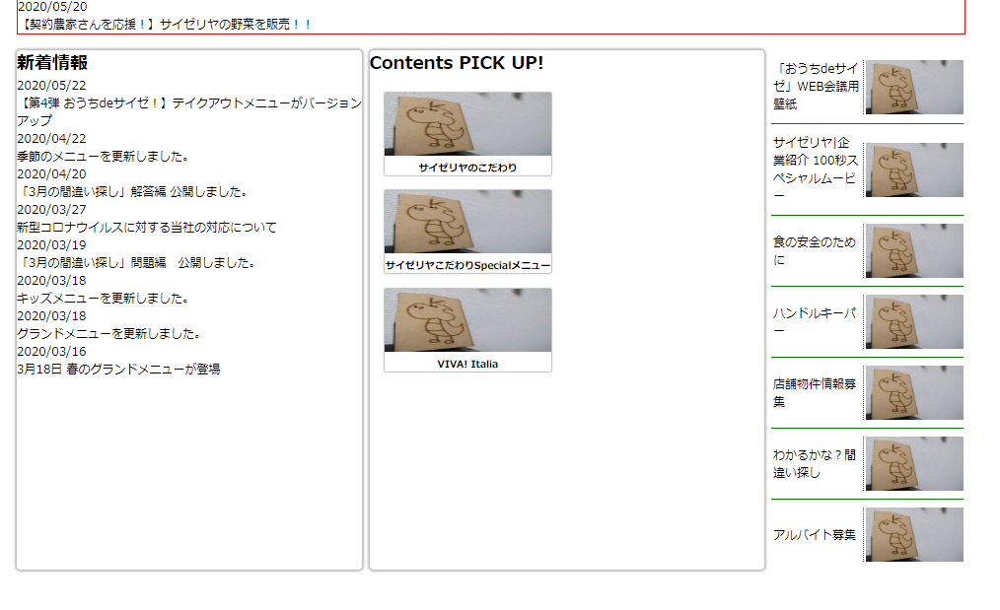

# 概要

* CSSレイアウト

## HTMLを書く

index.html

```HTML
<!DOCTYPE html>
<html>

<head>
	<link href="style.css" rel="stylesheet" type="text/css" />
</head>

<body>
	<div>
		<h2>重要なお知らせ</h2>
		<dl>
			<dt>2020/05/26</dt>
			<dd>緊急事態宣言解除に伴う当社の対応について</dd>
			<dt>2020/05/22</dt>
			<dd>【第4弾 おうちdeサイゼ！】テイクアウトメニューがバージョンアップ</dd>
			<dt>2020/05/20</dt>
			<dd>【契約農家さんを応援！】サイゼリヤの野菜を販売！！</dd>
		</dl>
	</div>
	<div>
		<div>
			<div>
				<h2>新着情報</h2>
			</div>
			<dl>
				<dt>2020/05/22</dt>
				<dd>【第4弾 おうちdeサイゼ！】テイクアウトメニューがバージョンアップ</dd>
				<dt>2020/04/22</dt>
				<dd>季節のメニューを更新しました。</dd>
				<dt>2020/04/20</dt>
				<dd>「3月の間違い探し」解答編 公開しました。</dd>
				<dt>2020/03/27</dt>
				<dd>新型コロナウイルスに対する当社の対応について</dd>
				<dt>2020/03/19</dt>
				<dd>「3月の間違い探し」問題編　公開しました。</dd>
				<dt>2020/03/18</dt>
				<dd>キッズメニューを更新しました。</dd>
				<dt>2020/03/18</dt>
				<dd>グランドメニューを更新しました。</dd>
				<dt>2020/03/16</dt>
				<dd>3月18日 春のグランドメニューが登場</dd>
			</dl>
		</div>
		<div>
			<div>
				<h2>Contents PICK UP!</h2>
			</div>
			<div>
				
				<h3>サイゼリヤのこだわり</h3>
			</div>
			<div>
				
				<h3>サイゼリヤこだわりSpecialメニュー</h3>
			</div>
			<div>
				
				<h3>VIVA! Italia</h3>
			</div>
		</div>
		<div>
			<ul>
				<li>
					<p>「おうちdeサイゼ」WEB会議用壁紙</p>
					
				</li>
				<li>
					<p>サイゼリヤ|企業紹介 100秒スペシャルムービー</p>
					
				</li>
				<li>
					<p>食の安全のために</p>
					
				</li>
				<li>
					<p>ハンドルキーパー</p>
					
				</li>
				<li>
					<p>店舗物件情報募集</p>
					
				</li>
				<li>
					<p>わかるかな？間違い探し</p>
					
				</li>
				<li>
					<p>アルバイト募集</p>
					
				</li>
			</ul>
		</div>
	</div>

</body>

</html>
```

## CSSファイルを用意する

style.css

```CSS
* {
	margin: 0;
	padding: 0;
	box-sizing: border-box;
}
```

* box-sizing: 
  * border-box ... 幅高さの指定を枠線まで含めた値にする→実際の値に近い
  * content-box ... 幅高さの指定をpaddingより内側にする

## 画像を用意する

image/dragon.jpg


## 大まかなレイアウトをする


bodyの幅を960pxで固定して中央寄せする

```CSS
body {
	width: 960px;
	margin: 0 auto;
	font-size: 12px;
}
```

* margin: 引数の数によって適用するところが変わる
  * 1つ - 上下左右
  * 2つ - 上下 左右
  * 3つ - 上 左右 下
  * 4つ - 上 右 下 左
* 左右の値をautoにすると均等に割り振ってくれる→中央に揃う

### divにclassを紐付ける

4つのブロックをdivで囲いそれぞれにclassを適用する。下3つは横に並べたいのでさらにdivで囲んでclassを作る

今回はdivは既にあるのでclassを書いていく

```HTML
<body>
	<div class="important">
		<h2>重要なお知らせ</h2>
```

```HTML
	<div class="content-horizontal">
		<div class="whatsnew">
			<div>
				<h2>新着情報</h2>
```

```HTML
		<div class="pickup">
			<div>
				<h2>Contents PICK UP!</h2>
```

```HTML
		<div class="rightList">
			<ul>
				<li>
					<p>「おうちdeサイゼ」WEB会議用壁紙</p>
					
```

### classごとに大きさを決める

bodyの幅を960px固定にしたのでそれに合わせて調整する

```CSS
.important {
	width: 960px;
}
```

```CSS
.whatsnew {
	width: 350px;
}
```

```CSS
.pickup {
	width: 400px;
}
```

```CSS
.rightList {
	width: 195px;
}
```

> 本家に合わせたので...

### 横並びにする

```CSS
.content-horizontal {
	display: flex;
	flex-direction: row;
	width: 960px;
}
```


## pickupのバナーをつくる

画像と文字のセットにclassを設定して見た目を整える

```HTML
			<div>
				<h2>Contents PICK UP!</h2>
			</div>
			<div class="banner">
				
				<h3>サイゼリヤのこだわり</h3>
			</div>
			<div class="banner">
				
				<h3>サイゼリヤこだわりSpecialメニュー</h3>
			</div>
			<div class="banner">
				
				<h3>VIVA! Italia</h3>
			</div>
```
```CSS
.pickup .banner {
	width: 169px;
	margin: 15.5px;
}

.pickup .banner img {
	width: 169px;
	height: 64px;
}

.pickup .banner h3 {
	font-size: 10px;
	text-align: center;
}
```

バナーに影と角丸をつけてみる

```CSS
.pickup .banner {
	box-sizing: border-box;
	width: 169px;
	margin: 15.5px;
	box-shadow:0 0 1px 1px #00000040;
	border-radius: 2px;
}
```

* box-shadow 要素に影をつける。引数の数によって色々変わる
  * 3つ - オフセットx オフセットy 色
  * 4つ - オフセットx オフセットy ぼかし 色
  * 5つ - オフセットx オフセットy ぼかし 広がり 色

* border-radius 角を丸くする


## 右のリストの見た目を整える

文字と画像は横並びにする

文字は縦方向に中央揃え

```CSS
.rightList li {
	list-style-type: none;
	display: flex;
	flex-direction: row;
	align-items: center;
}

.rightList li p {
	width: 128px;
	margin: 2px;
}

.rightList li img {
	width: 77px;
	height: 55px;
	border-left: 1px dotted green;
	padding-left: 2px;
}
```

* align-items flex-directionの垂直方向の位置を決める

### 間に線を引く

リストの要素の間に線を引きたい

全ての要素の上にborderを定義すると一番上にもついてしまう

隣接セレクタ！

```CSS
.rightList li + li {
	border-top: 1px solid green;
}
```

要素A + 要素B

で、要素Aを前に持つ要素Bのみにスタイルが適用される

ついでにpaddingを追加しておく

```CSS
.rightList li {
	list-style-type: none;
	display: flex;
	flex-direction: row;
	align-items: center;
	padding: 8px 0;
}
```


## かたまりごとに囲う

枠線つけたり影付けたりマージンとったり

```CSS
.important {
	width: 960px;
	border: 1px solid red;
}
```

```CSS
.whatsnew {
	width: 350px;
	border-radius: 4px;
	box-shadow:0 0 2px 2px #00000040;
}
```

```CSS
.pickup {
	width: 400px;
	border-radius: 4px;
	box-shadow:0 0 2px 2px #00000040;
	margin: 0 7.5px;
}
```

```CSS
.content-horizontal {
	display: flex;
	flex-direction: row;
	width: 960px;
	margin-top: 16px;
}
```



3つの高さが揃ってしまっている

```CSS
.content-horizontal {
	display: flex;
	flex-direction: row;
	width: 960px;
	margin-top: 16px;
	align-items: start;
}
```

## pickupの並べ方

flexで並べてはみ出したら改行する

```CSS
.pickup {
	width: 400px;
	border-radius: 4px;
	box-shadow:0 0 2px 2px #00000040;
	margin: 0 7.5px;
	display: flex;
	flex-direction: row;
	flex-wrap: wrap;
}
```

* flex-wrap 折返しの指定

## 定義リストをきれいにする

dtをfloatで左寄せにし、その分左に隙間を開けてddを配置する

```CSS
.important dl dt {
	width: 72px;
	float: left;
}

.important dl dd {
	padding-left: 96px;
	color: red;
}
```

新着情報の方もやる

```CSS
.whatsnew dt {
	float: left;
	width: 72px;
}

.whatsnew dd {
	padding-left: 96px;
	margin: 8px 0;
	color: green;
}
```

## 新着情報のリストの間に線を引く

今度は要素の下に線を引かせ、最後の要素のみ消すようにする

擬似クラス！

要素:last-child で最後の要素に適用できる

```CSS
.whatsnew dd {
	padding-left: 96px;
	border-bottom: 1px dotted green;
	margin: 8px 0;
	color: green;
}

.whatsnew dd:last-child {
	border-bottom: none;
}
```

ついでに

```CSS
.whatsnew dl {
	margin: 8px;
}
```


## 見出しをきれいに

### 重要なお知らせの方

見出しとリストを横並びにする

```CSS
.important {
	width: 960px;
	border: 1px solid red;
	display: flex;
	flex-direction: row;
}
```

色を付けて間に線を引いたり

```CSS
.important h2 {
	color: red;
	margin: 4px;
}

.important dl {
	border-left: 1px dotted red;
	padding-left: 4px;
	margin: 4px;
}
```

### 新着とPickup

背景を付けたいのでclassで囲む

```HTML
			<div class="content-h2">
				<h2>新着情報</h2>
			</div>
```

```HTML
			<div class="content-h2">
				<h2>Contents PICK UP!</h2>
			</div>
```

```CSS
.content-horizontal .content-h2 {
	display: flex;
	align-items: center;
	height: 47px;
	width: 100%;
	background-color: green;
	border-top-left-radius: 4px;
	border-top-right-radius: 4px;
}

.content-horizontal .content-h2 h2 {
	border-left: 2px solid greenyellow;
	padding-left: 4px;
	margin-left: 4px;
	color: white;
}
```

背景を付けて中央寄せして左に線を添えた


?


# おしまい

[サイゼリヤ様のホームページ](https://www.saizeriya.co.jp/index.php)