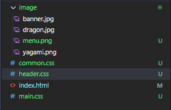
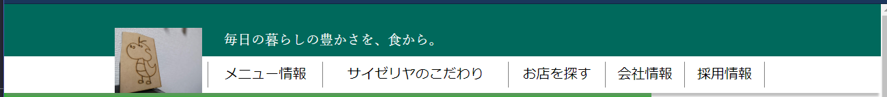
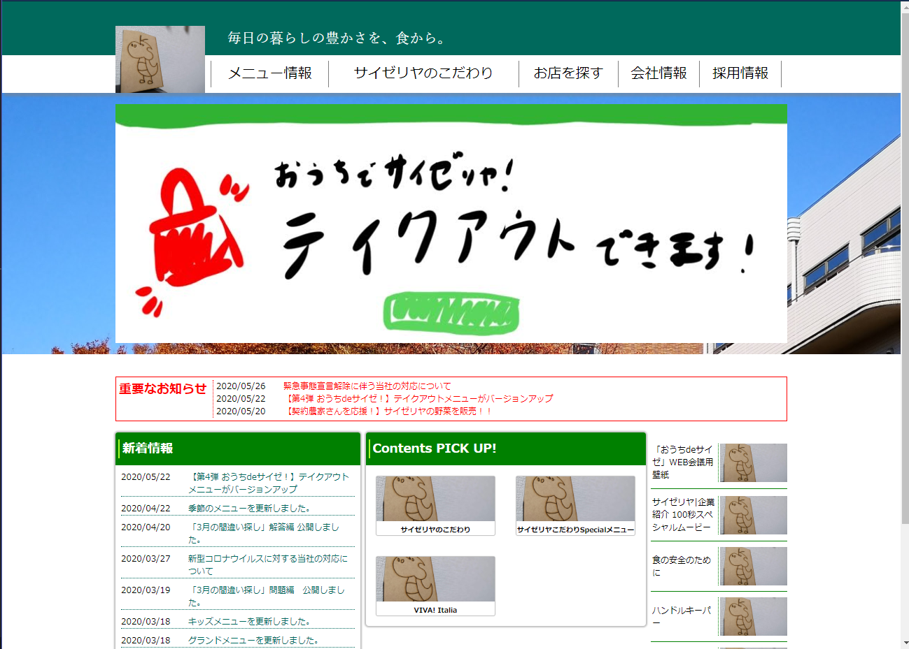
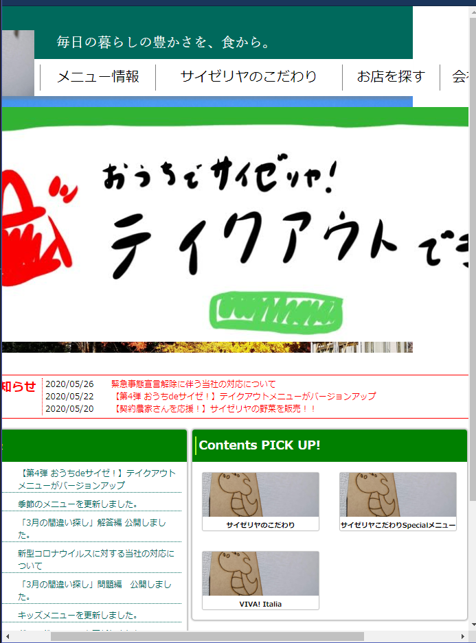
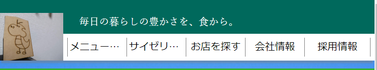
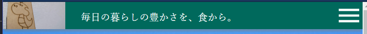
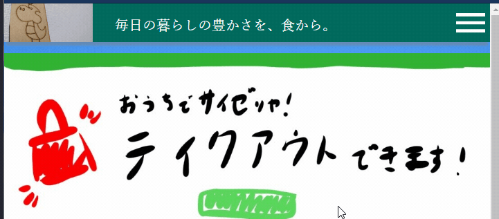
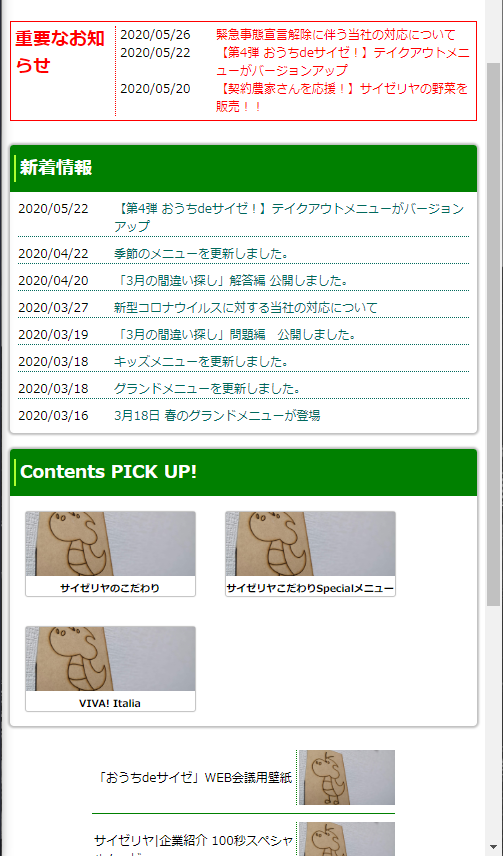

# 概要

* レスポンシブデザイン
* その他テクニック

教科書はもう使ってないです(なぜかレスポンシブへの言及がなかった)

# 雛形のHTML

day4で作ったヘッダとday5のコンテンツをあわせたみたいな感じ

index.html

```HTML
<!DOCTYPE html>
<html>

<body>
	<header>
		<div class="header_bg"></div>
		<div class="header_layout">
			
			<p id="leading">毎日の暮らしの豊かさを、食から。</p>
			<nav>
				<ul>
					<li>メニュー情報</li>
					<li>サイゼリヤのこだわり</li>
					<li>お店を探す</li>
					<li>会社情報</li>
					<li>採用情報</li>
				</ul>
			</nav>
		</div>
	</header>
	<div class="main_banner">
		
	</div>
	<main>
		<div class="important">
			<h2>重要なお知らせ</h2>
			<dl>
				<dt>2020/05/26</dt>
				<dd>緊急事態宣言解除に伴う当社の対応について</dd>
				<dt>2020/05/22</dt>
				<dd>【第4弾 おうちdeサイゼ！】テイクアウトメニューがバージョンアップ</dd>
				<dt>2020/05/20</dt>
				<dd>【契約農家さんを応援！】サイゼリヤの野菜を販売！！</dd>
			</dl>
		</div>
		<div class="content-horizontal">
			<div class="whatsnew">
				<div class="content-h2">
					<h2>新着情報</h2>
				</div>
				<dl>
					<dt>2020/05/22</dt>
					<dd>【第4弾 おうちdeサイゼ！】テイクアウトメニューがバージョンアップ</dd>
					<dt>2020/04/22</dt>
					<dd>季節のメニューを更新しました。</dd>
					<dt>2020/04/20</dt>
					<dd>「3月の間違い探し」解答編 公開しました。</dd>
					<dt>2020/03/27</dt>
					<dd>新型コロナウイルスに対する当社の対応について</dd>
					<dt>2020/03/19</dt>
					<dd>「3月の間違い探し」問題編　公開しました。</dd>
					<dt>2020/03/18</dt>
					<dd>キッズメニューを更新しました。</dd>
					<dt>2020/03/18</dt>
					<dd>グランドメニューを更新しました。</dd>
					<dt>2020/03/16</dt>
					<dd>3月18日 春のグランドメニューが登場</dd>
				</dl>
			</div>
			<div class="pickup">
				<div class="content-h2">
					<h2>Contents PICK UP!</h2>
				</div>
				<div class="banner">
					
					<h3>サイゼリヤのこだわり</h3>
				</div>
				<div class="banner">
					
					<h3>サイゼリヤこだわりSpecialメニュー</h3>
				</div>
				<div class="banner">
					
					<h3>VIVA! Italia</h3>
				</div>
			</div>
			<div class="rightList">
				<ul>
					<li>
						<p>「おうちdeサイゼ」WEB会議用壁紙</p>
						
					</li>
					<li>
						<p>サイゼリヤ|企業紹介 100秒スペシャルムービー</p>
						
					</li>
					<li>
						<p>食の安全のために</p>
						
					</li>
					<li>
						<p>ハンドルキーパー</p>
						
					</li>
					<li>
						<p>店舗物件情報募集</p>
						
					</li>
					<li>
						<p>わかるかな？間違い探し</p>
						
					</li>
					<li>
						<p>アルバイト募集</p>
						
					</li>
				</ul>
			</div>
		</div>
	</main>
</body>

</html>

```

# CSSを用意する

今回は記述量が多いので分ける

* 全体の共通要素 → common.css
* ヘッダ装飾 → header.css
* コンテンツ装飾 → main.css

## common.css

```CSS
* {
	margin: 0;
	padding: 0;
	box-sizing: border-box;
}

img {
	object-fit: cover;
}

```

* 「*」... 全要素に適用
* box-sizing: border-box ... heightとwidthをpaddingとborderを含んだ値にする
* object-fit: cover ... 画像を指定の大きさで自然にリサイズする

## main.css

コンテンツ部分。day5とだいたい同じなので説明は割愛

```CSS
main {
	width: 960px;
	margin: 0 auto;
	font-size: 12px;
}

.important {
	width: 960px;
	border: 1px solid red;
	display: flex;
	flex-direction: row;
	margin-top: 32px;
}

.important h2 {
	color: red;
	margin: 4px;
}

.important dl {
	border-left: 1px dotted red;
	padding-left: 4px;
	margin: 4px;
}

.important dl dt {
	width: 72px;
	float: left;
}

.important dl dd {
	margin-left: 96px;
	color: red;
}

.content-horizontal {
	display: flex;
	flex-direction: row;
	width: 960px;
	margin-top: 16px;
	align-items: baseline;
}

.content-horizontal .content-h2 {
	display: flex;
	align-items: center;
	height: 47px;
	width: 100%;
	background-color: green;
	border-top-left-radius: 4px;
	border-top-right-radius: 4px;
}

.content-horizontal .content-h2 h2 {
	border-left: 2px solid greenyellow;
	padding-left: 4px;
	margin-left: 4px;
	color: white;
}

.whatsnew {
	box-sizing: border-box;
	width: 350px;
	border-radius: 4px;
	box-shadow:0 0 2px 2px #00000040;
	height: auto;
}

.whatsnew dl {
	margin: 8px;
}

.whatsnew dt {
	float: left;
	width: 72px;
}

.whatsnew dd {
	padding-left: 96px;
	border-bottom: 1px dotted #00695C;
	margin: 8px 0;
	color: #00695C;
}

.whatsnew dd:last-child {
	border-bottom: none;
}

.pickup {
	width: 400px;
	border-radius: 4px;
	box-shadow:0 0 2px 2px #00000040;
	display: flex;
	flex-direction: row;
	flex-wrap: wrap;
	margin: 0 7.5px;
}

.pickup h2 {
	width: 100%;
}

.pickup .banner {
	width: 169px;
	margin: 4px;
	box-shadow:0 0 1px 1px #00000040;
	margin: 15.5px;
	border-radius: 2px;
}

.pickup .banner img {
	width: 169px;
	height: 64px;
}

.pickup .banner h3 {
	font-size: 10px;
	text-align: center;
}

.rightList {
	width: 195px;
}

.rightList li {
	list-style-type: none;
	display: flex;
	flex-direction: row;
	align-items: center;
	padding: 8px 0;
}

.rightList li + li {
	border-top: 1px solid green;
}

.rightList li p {
	width: 96px;
	margin: 2px;
}

.rightList li img {
	width: 99px;
	height: 55px;
	border-left: 1px dotted green;
	padding-left: 2px;
}

```

## header.css

ヘッダ部分。中身は後で書く

## HTMLに読み込み

```HTML
<html>

<head>
	<link href="common.css" rel="stylesheet" type="text/css" />
	<link href="main.css" rel="stylesheet" type="text/css" />
	<link href="header.css" rel="stylesheet" type="text/css" />
</head>

<body>
```

順番大事。上から下に読み込むので下が優先される→より一般的なものを上に書く

# 画像を用意



今回は4つ使うのでimageフォルダに入れておく

# ヘッダを整形する

ロゴ画像(#logo)をヘッダの左下に表示する

親要素の絶対位置に表示したい場合は親要素にposition: relative、子要素にposition: absoluteを適用する

```CSS
.header_layout {
	position: relative;
}

.header_layout #logo {
	position: absolute;
	left: 0;
	bottom: 0;
	height: 96px;
	width: 128px;
}
```

ナビゲーションなりが重なって見えないのでlogoを避けて縦に並べる

```CSS
.header_layout {
	position: relative;
	display: flex;
	flex-direction: column;
	justify-content: flex-end;
}

/*...*/

.header_layout #leading {
	margin-left: 128px;
}

nav {
	margin-left: 128px;
}
```

flexで縦に並べてそれぞれの要素の左側にlogo分のmarginを設ける

navを整形

```CSS

nav {
	margin-left: 128px;
	padding: 8px;
	width: 832px;
}

nav ul {
	display: table;
	width: 100%;
	flex-direction: row;
	justify-content: center;
}

nav ul li {
	user-select: none;
	display: table-cell;
	padding: 4px;
	margin: 4px;
	list-style-type: none;
	text-align: center;
	border-left: 1px solid #808080;
}

nav ul li:last-child {
	border-right: 1px solid #808080;
}

nav ul li:hover {
	background-color: #BCAAA480;
}
```

day4で作ったのとだいたい同じ

display: table、table-cellを付けると全体の幅によっていい感じに広がってくれる

## 全体のレイアウト

ヘッダを中央揃え、ついでに背景色とか影を付ける

```CSS
header {
	position: relative;
	background-color: #00695C;
	box-shadow: 0 8px 3px -3px #80808080;
}

header .header_bg {
	position: absolute;
	bottom: 0;
	width: 100%;
	height: 54px;
	background-color: #ffffff;
}

.header_layout {
	position: relative;
	display: flex;
	flex-direction: column;
	justify-content: flex-end;
	margin: 0 auto;
	width: 960px;
	height: 131px;
}
```

定数の幅を持って左右のmarginをautoにすると中央揃えしてくれる

leadingも装飾

```CSS
.header_layout #leading {
	margin-left: 128px;
	color: white;
	font-family: serif;
	padding-left: 32px;
	padding-bottom: 8px;
}
```



## 下のバナーも作っちゃう

```CSS
.main_banner {
	background-image: url(image/yagami.png);
	background-size: cover;
	width: 100%;
	padding-top: 16px;
	padding-bottom: 16px;
}

.main_banner img {
	width: 960px;
	margin: 0 auto;
	display: block;
}
```

画像はimgタグでHTMLに書く方法の他に、cssでurlを指定する方法もある。

img要素はデフォルトがdisplay: blockじゃないようで指定しないと中央揃えが上手くいかない

いい感じにページができたね！



# 問題点

幅を縮めるとレイアウトが死ぬ



→スマホの表示がやばい

# レスポンシブデザインについて

「閲覧者の画面サイズまたはウェブブラウザに応じてデスクトップウェブページが閲覧できることを目指したウェブデザインの手法。」(https://ja.wikipedia.org/wiki/レスポンシブウェブデザイン)

PCだけでなくタブレットやスマホでも見やすいように画面サイズによって表示を変えましょうというお話

2015年4月~ Google検索がモバイルフレンドリーに(モバイルゲドン)

2018年3月~ Google検索がモバイルファーストに

> モバイルフレンドリー ... モバイル向け表示作らないと検索順位下げるぞ

> モバイルファースト ... モバイル向け表示を優先して評価するぞ

## PCとスマホで表示を最適化する方法

### スマートフォン専用ページを用意する

例) ニコニコ動画

PC向けのwww.nicovideo.jpとスマートフォン向けのsp.nicovideo.jpを用意している

* 別々に作るので双方への最適化が可能
* 両方運用するの面倒
* user-agentで振り分けるので将来的に使えなくなるかも？

### 画面サイズによって表示を切り替える

例) ロイヤルホスト([royalhost.jp](https://www.royalhost.jp/))

* 一つのページで対応できる
* 全てに合うレイアウト組むのが面倒
* 変な画面サイズのに出会うと表示がおかしくなるかも

## 基準点

横幅で振り分ける

* 896px~ ... PC向け
* 480px~896px ... タブレット向け
* ~480px ... スマホ向け

> スマホは解像度高いやつでも複数画素を1pxとして換算するようになっている(dp)ので実際は1440pxとかあっても表示上は480pxに収まる

# レスポンシブデザインで組んでみる(原作超え)

## メインバナー

とりあえず最大幅を100%にすれば画面からはみ出さなくなる

```CSS
.main_banner img {
	width: 960px;
	max-width: 100%;
	margin: 0 auto;
	display: block;
}
```

## ヘッダー

同様に

```CSS
.header_layout {
	position: relative;
	display: flex;
	flex-direction: column;
	justify-content: flex-end;
	margin: 0 auto;
	width: 960px;
	height: 131px;
	max-width: 100%;
}
```

ナビゲーションを伸縮するようにする

画面サイズに対して左に128pxの幅を持ちたい

calc関数を使うとCSS内で計算ができる。違う単位同士でもできる

```CSS
nav {
	margin-left: 128px;
	padding: 8px;
	width: 832px;
	max-width: calc(100% - 128px);
	height: 54px;
}

nav ul li {
	user-select: none;
	display: table-cell;
	padding: 4px;
	margin: 4px;
	list-style-type: none;
	text-align: center;
	border-left: 1px solid #808080;
	text-overflow: ellipsis;
	overflow: hidden;
	white-space: nowrap;
	max-width: 0;
}
```

* text-overflow: ellipsis ... 文字がはみ出たときは三点リーダーを付ける
* overflow: hidden ... 文字がはみ出たときは切り取る
* white-space: nowrap ... 勝手に改行しない
* max-width: 0 ... listの要素幅を一定にしてくれる、なぜかはよく分からない([参照](https://stackoverflow.com/questions/26292408/why-does-this-behave-the-way-it-does-with-max-width-0))

はみ出さなくなった



> 全部読めないのは妥協点。誰か解決してくれ

### 幅によって使うCSSを切り替える

流石に幅が狭いとナビゲーションが読めない

CSSのメディアクエリを利用して幅が特定の時にCSSを使おう

```CSS
@media screen and (max-width: 896px) {
	/*896px以下の時に使うCSS
	.hogehoge {
		...
	}
	*/
}
```

header.cssの最後に追加する

```CSS
@media screen and (max-width: 896px) {
	.header_layout {
		height: 56px;
	}

	.header_bg {
		display: none;
	}

	.header_layout #logo {
		height: 56px;
	}
}
```

896px以下にした時にヘッダの高さが変わる

### メニューを隠す

小さい画面に並べるのは見にくいからメニューボタンに隠してしまおう

```HTML
<p id="leading">毎日の暮らしの豊かさを、食から。</p>

<nav>
```

menu_buttonをHTMLに追加。通常時は見えなくていいので消す

mediaの外、上の方

```CSS
.header_layout #menu_button {
	display: none;
}
```

896px以下の時に表示(displayをblockで上書き)。絶対位置で右上に表示。

全面に表示したいのでz-indexに1を指定

```CSS
@media screen and (max-width: 896px) {
	/*...*/

	.header_layout #menu_button {
		position: absolute;
		right: 0;
		top: 0;
		display: block;
		height: 56px;
		width: 56px;
		z-index: 1;
	}
}
```

ナビゲーションを上書きして縦並びに修正。絶対位置で見えない位置に配置

```CSS
@media screen and (max-width: 896px) {
	/*...*/

	nav {
		height: 200px;
		width: 100%;
		position: absolute;
		bottom: 56px;
		padding: 0;
		background-color: teal;
	}

	nav ul {
		flex-direction: column;
		display: flex;
	}

	nav ul li {
		height: 40px;
		margin: 0 8px;
		display: block;
		max-width: none;
		border-left: none;
		border-bottom: 1px solid #808080;
		color: white;
	}

	nav ul li:last-child {
		border-right: none;
		border-bottom: none;
	}
}
```

すっきり



### ボタンhoverでメニューが出てくるようにする

CSSだけでもアニメーションが組める

transitionプロパティで要素が変化したときの時間等を指定できる

```CSS
@media screen and (max-width: 896px) {
	/*...*/

	nav {
		height: 200px;
		width: 100%;
		position: absolute;
		bottom: 56px;
		padding: 0;
		transition: bottom 2.0s;
		background-color: teal;
	}

	nav:hover {
		bottom: -200px;
	}
}
```

bottomが変化する時に2秒かけて移動する

bottomを 0pxにして確かめよう

menuボタンをhoverした時にナビゲーションのbottomを弄りたい

一般兄弟結合子 ~ で結ぶ

同じ階層かつ左の要素のほうが上の場合その要素を呼ぶことができる

```CSS
@media screen and (max-width: 896px) {
	/*...*/

	.header_layout #menu_button:hover ~ nav {
		bottom: -200px;
	}
}
```

完成



ついでにleadingも見切れるので狭い時に消す

末尾に追加

```CSS
@media screen and (max-width: 480px) {
	.header_layout #leading {
		display: none;
	}
}
```

## コンテンツ

main.css

```CSS
main {
	width: 960px;
	max-width: 100%; /*追加！*/
	margin: 0 auto;
	font-size: 12px;
}

.important {
	width: 960px;
	border: 1px solid red;
	display: flex;
	flex-direction: row;
	margin-top: 32px;
	max-width: calc(100% - 16px);/*追加！*/
	margin-left: 8px;/*追加！*/
	margin-right: 8px;/*追加！*/
}

.content-horizontal {
	display: flex;
	flex-direction: row;
	width: 960px;
	margin-top: 16px;
	align-items: baseline;
	max-width: 100%;/*追加！*/
}

/*追加！*/
@media screen and (max-width: 896px) {
	.content-horizontal {
		flex-direction: column;
		padding: 8px;
	}

	.whatsnew {
		width: 100%;
	}

	.pickup {
		width: 100%;
		margin: 16px 0;
	}

	.rightList {
		display: flex;
		width: 100%;
		justify-content: center;
		align-items: center;
	}

	.rightList li {
		margin: 0 auto;
	}

	.rightList li p {
		width: 200px;
	}
}
```

はい



# おしまい

CSS完全に理解できたね
